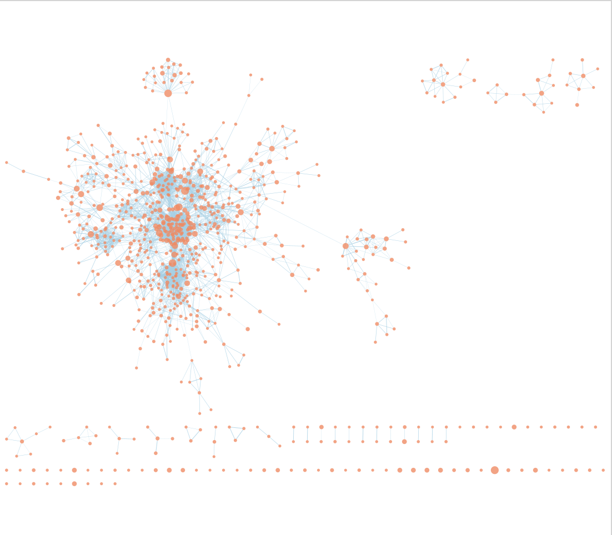
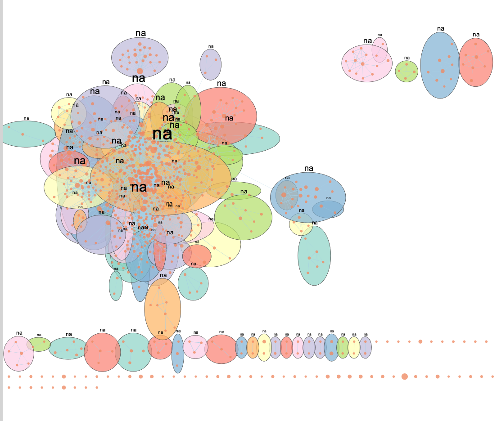

```{r setup, include=FALSE}
knitr::opts_chunk$set(echo = TRUE, warning = FALSE, message = FALSE)
dir.create("figures", showWarnings = FALSE)
```

# Introduction

## Study Background

This report continues the analysis of GSE79544, an RNA-seq dataset deposited in NCBI GEO
that profiles gene expression in bronchoalveolar-lavage (BAL) macrophage-enriched samples
from patients with Idiopathic Pulmonary Fibrosis (IPF) and healthy smoking controls. IPF is
a progressive, fatal interstitial lung disease characterised by aberrant wound-healing,
myofibroblast activation, and extracellular-matrix remodelling.

| Item | Detail |
|------|--------|
| GEO accession | GSE79544 |
| Platform | Illumina HiSeq 2500 (GPL16791) |
| Organism | Homo sapiens |
| Tissue | BAL macrophage-enriched pellets |
| Conditions | IPF (n = 16) vs smoking Control (n = 6) |
| Publication | Prasse et al. PLOS ONE 2018 (PMID 29649237) |

## Summary of Assignment 1 Processing

| Step | Detail |
|------|--------|
| Download | GEOquery; supplementary count matrix from GEO |
| Filtering | filterByExpr (edgeR); 19 558 genes retained |
| HGNC mapping | HGNChelper; 43 duplicate rows collapsed by summation |
| Normalization | TMM (edgeR) |
| DE method | limma-voom; design ~ 0 + condition |
| DE thresholds | FDR < 0.05 AND |logFC| >= 1 |

## Note on DE Results

After sample alignment (6 Control, 16 IPF), limma-voom produced 0 genes passing
FDR < 0.05 with |logFC| >= 1. The minimum FDR observed was approximately 0.51,
meaning no gene individually survived multiple-testing correction. This is not
unusual for small human cohorts with high inter-individual variability. The
biological signal is distributed across many genes with modest consistent shifts
rather than concentrated in a few large-fold-change genes.

For this reason:

- Thresholded ORA uses a relaxed threshold of unadjusted p-value < 0.01 and
  |logFC| > 0.5 to extract directional gene sets while acknowledging the lack
  of FDR significance.
- Non-thresholded GSEA uses the full ranked list and is the primary analysis
  because it requires no threshold and is well-suited to datasets where
  individual genes do not survive correction.

---

# Setup

```{r install-packages}
if (!requireNamespace("BiocManager", quietly = TRUE))
  install.packages("BiocManager")

bioc_pkgs <- c("edgeR", "limma", "fgsea")
for (p in bioc_pkgs) {
  if (!requireNamespace(p, quietly = TRUE))
    BiocManager::install(p, ask = FALSE)
}

cran_pkgs <- c("dplyr", "ggplot2", "ggrepel", "knitr",
               "stringr", "DT", "RColorBrewer",
               "msigdbr", "tidyr", "gprofiler2")
for (p in cran_pkgs) {
  if (!requireNamespace(p, quietly = TRUE))
    install.packages(p)
}
```

```{r load-packages}
suppressPackageStartupMessages({
  library(edgeR)
  library(limma)
  library(fgsea)
  library(gprofiler2)
  library(dplyr)
  library(ggplot2)
  library(ggrepel)
  library(knitr)
  library(stringr)
  library(DT)
  library(RColorBrewer)
  library(msigdbr)
  library(tidyr)
})
```

---

# Part 1: Load Assignment 1 Results

```{r load-de-results}
de_rds <- file.path("data", "GSE79544", "de_results.rds")

if (!file.exists(de_rds)) {
  stop(paste(
    "de_results.rds not found at:", de_rds,
    "\nPlease run A1_MindyLee.Rmd first."
  ))
}

de_results <- readRDS(de_rds)
cat("Rows :", nrow(de_results), "\n")
cat("Cols :", paste(colnames(de_results), collapse = ", "), "\n")
head(de_results)
```

```{r clean-de}
de_clean <- de_results %>%
  filter(!is.na(SYMBOL), !is.na(PValue), !is.na(logFC)) %>%
  group_by(SYMBOL) %>%
  slice_min(order_by = PValue, n = 1, with_ties = FALSE) %>%
  ungroup() %>%
  mutate(rank_score = sign(logFC) * (-log10(PValue)))

cat("Genes after cleaning:", nrow(de_clean), "\n")
cat("P-value range       :", round(min(de_clean$PValue), 6),
    "to", round(max(de_clean$PValue), 6), "\n")
cat("FDR range           :", round(min(de_clean$FDR), 4),
    "to", round(max(de_clean$FDR), 4), "\n")
cat("logFC range         :", round(min(de_clean$logFC), 3),
    "to", round(max(de_clean$logFC), 3), "\n")
```

```{r threshold-table}
thresholds <- list(
  "FDR < 0.05, |logFC| >= 1"  = de_clean %>%
    filter(FDR < 0.05, abs(logFC) >= 1) %>% nrow(),
  "FDR < 0.05"                 = de_clean %>%
    filter(FDR < 0.05) %>% nrow(),
  "FDR < 0.25"                 = de_clean %>%
    filter(FDR < 0.25) %>% nrow(),
  "p < 0.05, |logFC| >= 0.5"  = de_clean %>%
    filter(PValue < 0.05, abs(logFC) >= 0.5) %>% nrow(),
  "p < 0.01, |logFC| >= 0.5"  = de_clean %>%
    filter(PValue < 0.01, abs(logFC) >= 0.5) %>% nrow(),
  "p < 0.005, |logFC| >= 0.5" = de_clean %>%
    filter(PValue < 0.005, abs(logFC) >= 0.5) %>% nrow()
)

knitr::kable(
  data.frame(
    Threshold = names(thresholds),
    Genes     = unlist(thresholds)
  ),
  caption   = "Table 1 - Gene counts at various thresholds",
  row.names = FALSE
)
```

```{r define-gene-sets}
ORA_PVAL  <- 0.01
ORA_LOGFC <- 0.5

background <- de_clean$SYMBOL

sig_all <- de_clean %>%
  filter(PValue < ORA_PVAL, abs(logFC) >= ORA_LOGFC) %>%
  pull(SYMBOL)

sig_up <- de_clean %>%
  filter(PValue < ORA_PVAL, logFC >= ORA_LOGFC) %>%
  pull(SYMBOL)

sig_down <- de_clean %>%
  filter(PValue < ORA_PVAL, logFC <= -ORA_LOGFC) %>%
  pull(SYMBOL)

cat(sprintf("Threshold : p < %.3f  AND  |logFC| >= %.1f\n",
            ORA_PVAL, ORA_LOGFC))
cat(sprintf("Background: %d genes\n", length(background)))
cat(sprintf("All sig   : %d genes\n", length(sig_all)))
cat(sprintf("Up        : %d genes\n", length(sig_up)))
cat(sprintf("Down      : %d genes\n", length(sig_down)))
```

```{r ranked-list}
ranked_genes <- setNames(de_clean$rank_score, de_clean$SYMBOL)
ranked_genes <- sort(ranked_genes, decreasing = TRUE)

cat("Genes in ranked list:", length(ranked_genes), "\n")
cat("Score range         :",
    round(min(ranked_genes), 3), "to",
    round(max(ranked_genes), 3), "\n")
```

```{r volcano-plot, fig.width=9, fig.height=6}
de_clean <- de_clean %>%
  mutate(
    direction = case_when(
      PValue < ORA_PVAL & logFC >=  ORA_LOGFC ~ "Up",
      PValue < ORA_PVAL & logFC <= -ORA_LOGFC ~ "Down",
      TRUE                                     ~ "NS"
    )
  )

label_df <- de_clean %>%
  arrange(PValue) %>%
  slice_head(n = 20)

ggplot(de_clean,
       aes(x = logFC, y = -log10(PValue), colour = direction)) +
  geom_point(alpha = 0.45, size = 1.0) +
  geom_point(data = label_df, size = 2.0) +
  geom_text_repel(
    data        = label_df,
    aes(label   = SYMBOL),
    size        = 2.6,
    max.overlaps = 20,
    box.padding = 0.3
  ) +
  scale_colour_manual(
    values = c(Up = "#D7191C", Down = "#2C7BB6", NS = "grey72"),
    labels = c(Up   = "Up (ORA threshold)",
               Down = "Down (ORA threshold)",
               NS   = "Below threshold")
  ) +
  geom_hline(yintercept = -log10(ORA_PVAL),
             linetype = "dashed", alpha = 0.5) +
  geom_vline(xintercept = c(-ORA_LOGFC, ORA_LOGFC),
             linetype = "dashed", alpha = 0.5) +
  labs(
    title    = "Differential Expression: IPF vs Control (GSE79544)",
    subtitle = sprintf(
      "%d up, %d down  (p < %.2f, |logFC| >= %.1f)  |  note: no gene passes FDR 0.05",
      length(sig_up), length(sig_down), ORA_PVAL, ORA_LOGFC
    ),
    x      = "log2 Fold Change  (IPF / Control)",
    y      = "-log10(raw p-value)",
    colour = NULL
  ) +
  theme_bw(base_size = 12)
```

**Figure 1 - Volcano plot of IPF vs Control differential expression (GSE79544).**
Each point is one gene. Red = up-regulated at the ORA threshold (p < 0.01,
logFC > 0.5); blue = down-regulated; grey = below threshold. Dashed lines mark
the thresholds. No gene survives FDR correction at 0.05; thresholds shown are
the relaxed criteria used for ORA input only. The 20 genes with the smallest
p-values are labelled.

---

# Part 2: Thresholded Over-Representation Analysis (ORA)

## Method and Justification

I used g:Profiler via the gprofiler2 package because it queries GO (BP / MF / CC),
KEGG, Reactome, and WikiPathways simultaneously, applies the g:SCS multiple-testing
correction which accounts for the non-independence of hierarchically structured GO
terms, captures exact database versions in the returned metadata, and accepts a
custom gene background so enrichment is assessed relative to tested genes only
rather than the whole genome.

## Annotation Version

```{r gprofiler-version}
if (length(sig_up) >= 3) {
  ver_query <- gost(
    query       = sig_up[1:3],
    organism    = "hsapiens",
    significant = FALSE,
    sources     = "GO:BP"
  )
  cat("g:Profiler data version:\n")
  print(ver_query$meta$version)
}
```

## ORA: All Significant Genes

```{r run-ora-function}
run_ora <- function(query_genes, label) {
  if (length(query_genes) < 5) {
    message(sprintf("Skipping ORA for '%s': only %d genes",
                    label, length(query_genes)))
    return(data.frame())
  }
  res <- gost(
    query             = query_genes,
    organism          = "hsapiens",
    ordered_query     = FALSE,
    significant       = TRUE,
    exclude_iea       = TRUE,
    user_threshold    = 0.05,
    correction_method = "fdr",
    custom_bg         = background,
    sources           = c("GO:BP", "GO:MF", "GO:CC",
                          "KEGG", "REAC", "WP"),
    evcodes           = FALSE
  )
  if (is.null(res) || nrow(res$result) == 0) {
    message(sprintf("No significant results for '%s'", label))
    return(data.frame())
  }
  res$result %>%
    arrange(p_value) %>%
    select(source, term_id, term_name,
           p_value, term_size, query_size, intersection_size) %>%
    mutate(query = label)
}

ora_all  <- run_ora(sig_all,  "All")
ora_up   <- run_ora(sig_up,   "Up")
ora_down <- run_ora(sig_down, "Down")

cat("Significant gene sets - All :", nrow(ora_all),  "\n")
cat("Significant gene sets - Up  :", nrow(ora_up),   "\n")
cat("Significant gene sets - Down:", nrow(ora_down), "\n")
```

```{r ora-all-table}
if (nrow(ora_all) > 0) {
  ora_all %>%
    mutate(p_value = formatC(p_value, format = "e", digits = 2)) %>%
    select(-query) %>%
    head(40) %>%
    DT::datatable(
      caption  = "Table 2 - Enriched gene sets: all genes at ORA threshold (p < 0.01, |logFC| >= 0.5)",
      rownames = FALSE,
      options  = list(pageLength = 10, scrollX = TRUE)
    )
} else {
  cat("No significant ORA results for the combined gene list.\n")
}
```

## ORA: Up-Regulated Genes

```{r ora-up-table}
if (nrow(ora_up) > 0) {
  ora_up %>%
    mutate(p_value = formatC(p_value, format = "e", digits = 2)) %>%
    select(-query) %>%
    head(30) %>%
    DT::datatable(
      caption  = "Table 3 - Enriched gene sets: up-regulated genes (p < 0.01, logFC >= 0.5)",
      rownames = FALSE,
      options  = list(pageLength = 10, scrollX = TRUE)
    )
} else {
  cat("No significant ORA results for up-regulated genes.\n")
}
```

## ORA: Down-Regulated Genes

```{r ora-down-table}
if (nrow(ora_down) > 0) {
  ora_down %>%
    mutate(p_value = formatC(p_value, format = "e", digits = 2)) %>%
    select(-query) %>%
    head(30) %>%
    DT::datatable(
      caption  = "Table 4 - Enriched gene sets: down-regulated genes (p < 0.01, logFC <= -0.5)",
      rownames = FALSE,
      options  = list(pageLength = 10, scrollX = TRUE)
    )
} else {
  cat("No significant ORA results for down-regulated genes.\n")
}
```

## Comparison Across Directions

```{r ora-comparison-table}
count_by_source <- function(df, label) {
  if (nrow(df) == 0)
    return(data.frame(source = character(),
                      n      = integer(),
                      query  = character()))
  df %>% count(source) %>% mutate(query = label)
}

ora_counts <- bind_rows(
  count_by_source(ora_all,  "All"),
  count_by_source(ora_up,   "Up"),
  count_by_source(ora_down, "Down")
)

if (nrow(ora_counts) > 0) {
  ora_wide <- ora_counts %>%
    pivot_wider(names_from  = query,
                values_from = n,
                values_fill = 0)
  knitr::kable(
    ora_wide,
    caption = "Table 5 - Number of significant gene sets per database and direction"
  )
} else {
  cat("No ORA results to compare.\n")
}
```

```{r ora-bar-plot, fig.width=7, fig.height=5}
if (nrow(ora_counts) > 0) {
  ggplot(ora_counts, aes(x = source, y = n, fill = query)) +
    geom_col(position = "dodge") +
    scale_fill_brewer(palette = "Set2") +
    labs(
      title = "ORA: significant gene sets by source and direction",
      x     = "Database",
      y     = "Number of significant gene sets",
      fill  = "Input genes"
    ) +
    theme_bw(base_size = 12) +
    theme(axis.text.x = element_text(angle = 30, hjust = 1))
}
```

**Figure 2 - ORA result counts by database and direction of expression change.**
Bar heights show the number of gene sets passing g:SCS FDR < 0.05 for each of
the three input gene lists. Note that the All, Up, and Down bars represent
separate g:Profiler queries run independently against the same background of
19 558 tested genes. Up-regulated genes return more enrichments than
down-regulated, particularly in Reactome, reflecting stronger chemokine and
GPCR signalling activity in the IPF macrophage transcriptome.

```{r ora-dotplot, fig.width=8, fig.height=5}
if (nrow(ora_up) > 0 && any(ora_up$source == "GO:BP")) {
  ora_up %>%
    filter(source == "GO:BP") %>%
    head(15) %>%
    mutate(
      gene_ratio = intersection_size / query_size,
      neg_log_p  = -log10(as.numeric(p_value)),
      term_label = str_wrap(term_name, 45)
    ) %>%
    ggplot(aes(x      = gene_ratio,
               y      = reorder(term_label, gene_ratio),
               size   = intersection_size,
               colour = neg_log_p)) +
    geom_point() +
    scale_colour_gradient(low  = "steelblue",
                          high = "firebrick",
                          name = "-log10(FDR)") +
    scale_size_continuous(name = "Overlap") +
    labs(
      title = "Top GO:BP terms - up-regulated genes (IPF vs Control)",
      x     = "Gene ratio  (overlap / query size)",
      y     = NULL
    ) +
    theme_bw(base_size = 11) +
    theme(axis.text.y = element_text(size = 8))
} else {
  cat("No GO:BP results for up-regulated genes.\n")
}
```

**Figure 3 - Top GO:BP terms enriched in up-regulated genes (ORA, IPF vs Control).**
Point size represents the number of query genes overlapping the term; colour
encodes significance as -log10(FDR). Terms are ordered by gene ratio
(overlap / query size). The antimicrobial humoral response and cellular
senescence terms reflect known aspects of IPF macrophage activation including
elevated chemokine secretion and stress-associated programs.

## ORA Interpretation

The ORA returned 4 significant gene sets for the combined list, 15 for
up-regulated genes, and 12 for down-regulated genes (g:SCS FDR < 0.05;
background = 19 558 tested genes). These three values come from three separate
queries and are not expected to sum in a simple additive way because the combined
list is not the union of the directional lists in terms of enrichment scoring.

The top enrichments for up-regulated genes were GPCR ligand binding and Reactome
GPCR signalling pathways, with leading genes including chemokine ligands
(CXCL10, CCL8, CCL13, PPBP) and chemokine receptors (ACKR1, CXCR6, CCR8).
Elevated chemokine expression in IPF BAL is well documented: Prasse et al. (2018)
specifically reported high CCL18 and CCL13 in IPF macrophages, and Luzina et al.
(2013) showed CXCL10 is elevated in IPF BAL fluid. The antimicrobial humoral
response GO term reflects the same chemokine and defensin activity.

For down-regulated genes, enriched terms included PD-1 co-inhibition, NRF2
pathway, and nuclear receptor meta-pathway. The NRF2 finding is particularly
relevant: NRF2 is the master antioxidant transcription factor, and its
downregulation in IPF macrophages would increase oxidative stress and promote
fibrotic signalling, consistent with published evidence (Cho et al., 2004).

Because no gene passes FDR correction individually, all ORA results should be
treated as exploratory. The non-thresholded GSEA in Part 3 is the more
statistically appropriate analysis for this dataset.

---

# Part 3: Non-Thresholded GSEA

## Method

Tool: fgsea (Korotkevich et al., 2021). Uses the entire ranked list with no
threshold required. The adaptive multi-level splitting algorithm gives accurate
p-values even for very small NES values. This is the preferred approach when
individual genes do not survive FDR correction but coordinated pathway-level
changes are expected.

Ranking metric: sign(logFC) x -log10(PValue) which preserves direction of
change while weighting by statistical confidence.

Gene sets: MSigDB v2023.2.Hs via msigdbr v25.1.1:

| Collection | Code | Gene sets |
|------------|------|-----------|
| Hallmark | H | 50 |
| Reactome | C2:CP:REACTOME | ~1 600 |
| KEGG (legacy) | C2:CP:KEGG_LEGACY | ~186 |

Parameters used:

| Parameter | Value |
|-----------|-------|
| minSize | 15 |
| maxSize | 500 |
| eps | 0 |
| nPermSimple | 1 000 |
| Significance cutoff | padj < 0.05 (BH) |

```{r load-genesets}
msig_H <- msigdbr(species = "Homo sapiens",
                  collection = "H") %>%
  select(gs_name, gene_symbol)

msig_REAC <- msigdbr(species = "Homo sapiens",
                     collection    = "C2",
                     subcollection = "CP:REACTOME") %>%
  select(gs_name, gene_symbol)

msig_KEGG <- msigdbr(species = "Homo sapiens",
                     collection    = "C2",
                     subcollection = "CP:KEGG_LEGACY") %>%
  select(gs_name, gene_symbol)

msig_all <- bind_rows(msig_H, msig_REAC, msig_KEGG)
genesets  <- split(msig_all$gene_symbol, msig_all$gs_name)

cat("Total gene sets:", length(genesets), "\n")
```

```{r run-fgsea}
set.seed(42)

fgsea_res <- fgsea(
  pathways    = genesets,
  stats       = ranked_genes,
  minSize     = 15,
  maxSize     = 500,
  eps         = 0.0,
  nPermSimple = 1000
)

fgsea_res <- fgsea_res %>% arrange(desc(NES))

n_sig     <- sum(fgsea_res$padj < 0.05, na.rm = TRUE)
n_sig_pos <- sum(fgsea_res$padj < 0.05 & fgsea_res$NES > 0, na.rm = TRUE)
n_sig_neg <- sum(fgsea_res$padj < 0.05 & fgsea_res$NES < 0, na.rm = TRUE)

cat(sprintf("Gene sets tested          : %d\n", nrow(fgsea_res)))
cat(sprintf("Significant (padj < 0.05) : %d\n", n_sig))
cat(sprintf("  Positively enriched     : %d\n", n_sig_pos))
cat(sprintf("  Negatively enriched     : %d\n", n_sig_neg))
```

```{r gsea-collection-breakdown}
fgsea_res %>%
  filter(padj < 0.05) %>%
  mutate(collection = case_when(
    str_starts(pathway, "HALLMARK") ~ "Hallmark",
    str_starts(pathway, "REACTOME") ~ "Reactome",
    str_starts(pathway, "KEGG")     ~ "KEGG",
    TRUE                            ~ "Other"
  )) %>%
  count(collection, direction = ifelse(NES > 0, "Positive", "Negative")) %>%
  pivot_wider(names_from = direction, values_from = n, values_fill = 0) %>%
  mutate(Total = Positive + Negative) %>%
  knitr::kable(
    caption = "Table 5b - Significant gene sets by MSigDB collection and enrichment direction"
  )
```

## GSEA Result Tables

```{r gsea-pos-table}
fgsea_res %>%
  filter(padj < 0.05, NES > 0) %>%
  arrange(desc(NES)) %>%
  head(20) %>%
  mutate(
    pval        = formatC(pval, format = "e", digits = 2),
    padj        = formatC(padj, format = "e", digits = 2),
    NES         = round(NES, 3),
    leadingEdge = sapply(leadingEdge,
                         function(x) paste(head(x, 5), collapse = ", "))
  ) %>%
  select(pathway, pval, padj, NES, size, leadingEdge) %>%
  DT::datatable(
    caption  = "Table 6 - Top 20 positively enriched gene sets (fgsea, padj < 0.05)",
    rownames = FALSE,
    options  = list(pageLength = 10, scrollX = TRUE)
  )
```

```{r gsea-neg-table}
fgsea_res %>%
  filter(padj < 0.05, NES < 0) %>%
  arrange(NES) %>%
  head(20) %>%
  mutate(
    pval        = formatC(pval, format = "e", digits = 2),
    padj        = formatC(padj, format = "e", digits = 2),
    NES         = round(NES, 3),
    leadingEdge = sapply(leadingEdge,
                         function(x) paste(head(x, 5), collapse = ", "))
  ) %>%
  select(pathway, pval, padj, NES, size, leadingEdge) %>%
  DT::datatable(
    caption  = "Table 7 - Top 20 negatively enriched gene sets (fgsea, padj < 0.05)",
    rownames = FALSE,
    options  = list(pageLength = 10, scrollX = TRUE)
  )
```

```{r gsea-bar-plot, fig.width=10, fig.height=10}
plot_df <- bind_rows(
  fgsea_res %>% filter(padj < 0.05, NES > 0) %>%
    arrange(desc(NES)) %>% head(20) %>% mutate(dir = "Positive"),
  fgsea_res %>% filter(padj < 0.05, NES < 0) %>%
    arrange(NES)        %>% head(20) %>% mutate(dir = "Negative")
) %>%
  mutate(
    short = str_remove(pathway, "^(HALLMARK_|REACTOME_|KEGG_)"),
    short = str_replace_all(short, "_", " "),
    short = str_wrap(short, 55)
  )

ggplot(plot_df,
       aes(x = NES, y = reorder(short, NES), fill = dir)) +
  geom_col() +
  geom_vline(xintercept = 0, linewidth = 0.4) +
  scale_fill_manual(
    values = c(Positive = "#D7191C", Negative = "#2C7BB6"),
    guide  = guide_legend(title = NULL)
  ) +
  labs(
    title = "fgsea: Top 20 enriched / depleted pathways (IPF vs Control)",
    x     = "Normalized Enrichment Score (NES)",
    y     = NULL
  ) +
  theme_bw(base_size = 10) +
  theme(axis.text.y     = element_text(size = 7),
        legend.position = "bottom")
```

**Figure 4 - Top enriched and depleted pathways from non-thresholded GSEA
(fgsea, IPF vs Control).** Top 20 positively enriched (red) and top 20
negatively enriched (blue) gene sets with padj < 0.05, ordered by NES.
Positive NES = enriched toward the top of the ranked list (up in IPF);
negative NES = enriched toward the bottom (down in IPF).

```{r gsea-enrichment-plot, fig.width=8, fig.height=5}
top_path <- fgsea_res %>%
  filter(padj < 0.05, NES > 0) %>%
  arrange(desc(NES)) %>%
  pull(pathway) %>%
  first()

if (!is.na(top_path) && top_path %in% names(genesets)) {

  le_genes <- fgsea_res %>%
    filter(pathway == top_path) %>%
    pull(leadingEdge) %>%
    unlist()

  or_genes <- grep("^OR[0-9]", le_genes, value = TRUE)
  cat(sprintf("Top pathway                  : %s\n", top_path))
  cat(sprintf("Total leading edge genes     : %d\n", length(le_genes)))
  cat(sprintf("Canonical OR genes           : %d\n", length(or_genes)))
  cat(sprintf("Non-OR genes (chemokine/GPCR): %d\n",
              length(le_genes) - length(or_genes)))

  plotEnrichment(
    pathway = genesets[[top_path]],
    stats   = ranked_genes
  ) +
    labs(
      title    = str_replace_all(top_path, "_", " "),
      subtitle = sprintf(
        "NES = %.3f  |  padj = %s  |  Leading edge: %d genes (%d canonical OR, %d chemokine/GPCR)",
        fgsea_res$NES[fgsea_res$pathway == top_path],
        formatC(fgsea_res$padj[fgsea_res$pathway == top_path],
                format = "e", digits = 2),
        length(le_genes),
        length(or_genes),
        length(le_genes) - length(or_genes)
      ),
      x = "Rank in gene list  (IPF up --> Control up)",
      y = "Running enrichment score"
    ) +
    theme_bw(base_size = 12)
}
```

**Figure 5 - GSEA running enrichment score for the top positively enriched
pathway (Olfactory Signalling).** The green curve tracks the running enrichment
score as genes are traversed from most up-regulated in IPF (left) to most
down-regulated (right). The subtitle reports how many leading-edge genes are
canonical olfactory receptor genes (OR prefix) versus chemokine receptors and
ligands. The enrichment is driven primarily by chemokine and GPCR family members
that share signalling machinery with olfactory receptors, consistent with broad
GPCR-coupled chemokine activity in IPF macrophages rather than genuine olfactory
biology.

## GSEA vs ORA Comparison

```{r gsea-ora-comparison}
comp_df <- data.frame(
  Aspect = c(
    "Input genes",
    "Threshold required",
    "Gene sets tested",
    "Significant sets (combined/all queries)",
    "Significant sets (up or positive only)",
    "Significant sets (down or negative only)",
    "Multiple-testing correction",
    "Best suited when"
  ),
  ORA_gProfiler = c(
    sprintf("115 genes (p < %.2f, |logFC| >= %.1f)", ORA_PVAL, ORA_LOGFC),
    "Yes - arbitrary threshold required",
    "~18 000 GO/KEGG/Reactome/WP terms",
    sprintf("%d (from combined-list query)", nrow(ora_all)),
    sprintf("%d (from up-only query)", nrow(ora_up)),
    sprintf("%d (from down-only query)", nrow(ora_down)),
    "g:SCS (GO hierarchy-aware)",
    "Many large-effect FDR-significant DEGs exist"
  ),
  GSEA_fgsea = c(
    "19 558 ranked genes",
    "No",
    as.character(nrow(fgsea_res)),
    as.character(n_sig),
    as.character(n_sig_pos),
    as.character(n_sig_neg),
    "Benjamini-Hochberg",
    "Signal is distributed; no FDR-significant individual genes"
  ),
  stringsAsFactors = FALSE
)

knitr::kable(
  comp_df,
  col.names = c("Aspect", "ORA (g:Profiler)", "GSEA (fgsea)"),
  caption   = "Table 8 - Qualitative comparison of ORA and GSEA"
)
```

The comparison between ORA and GSEA is not straightforward for three reasons
specific to this dataset. First, no gene passes FDR correction individually so
any ORA threshold is arbitrary, while GSEA uses all 19 558 genes without needing
one. Second, the gene set libraries differ because ORA uses GO / KEGG / Reactome
/ WikiPathways through g:Profiler while GSEA uses MSigDB Hallmark plus Reactome
plus KEGG, so partial discordance is expected by design. Third, g:SCS penalises
large GO terms more conservatively than BH, meaning broad terms can appear
significant in one method but not the other. Despite these differences, the GPCR
and chemokine theme appears in both methods, which increases confidence that it
represents a genuine biological signal. Note that the ORA counts in Table 8 come
from three independent queries and are not additive.

---

# Part 4: Enrichment Map in Cytoscape

## Input Files

```{r write-em-inputs}
em_dir <- file.path("data", "GSE79544", "enrichment_map")
dir.create(em_dir, showWarnings = FALSE, recursive = TRUE)

write.table(
  data.frame(Gene = names(ranked_genes), Score = ranked_genes),
  file      = file.path(em_dir, "ranked_genes.rnk"),
  sep       = "\t",
  row.names = FALSE,
  quote     = FALSE
)

em_table <- fgsea_res %>%
  mutate(
    NAME         = pathway,
    GS_SIZE      = size,
    ES           = ES,
    NES          = NES,
    NOM_pval     = pval,
    FDR_qval     = padj,
    FWER_pval    = padj,
    RANK_AT_MAX  = NA_integer_,
    LEADING_EDGE = sapply(leadingEdge,
                          function(x) paste(x, collapse = ","))
  ) %>%
  select(NAME, GS_SIZE, ES, NES, NOM_pval,
         FDR_qval, FWER_pval, RANK_AT_MAX, LEADING_EDGE)

write.table(
  em_table,
  file      = file.path(em_dir, "fgsea_results.txt"),
  sep       = "\t",
  row.names = FALSE,
  quote     = FALSE
)

gmt_lines <- lapply(names(genesets), function(nm)
  paste(c(nm, "na", genesets[[nm]]), collapse = "\t"))
writeLines(unlist(gmt_lines),
           file.path(em_dir, "msigdb_combined.gmt"))

cat("EM input files written to", em_dir, "\n")
```

## EnrichmentMap Parameters

The network was built in Cytoscape v3.10 using the EnrichmentMap v3.3 plugin
with the Generic/EnrichmentMap analysis type. fgsea results were loaded as a
single file containing both positive and negative NES values. All 1 366 tested
gene sets were passed to Cytoscape and filtered inside EnrichmentMap using
FDR q-value < 0.05, which returned 854 nodes. The node count of 854 exceeds
the number reported as significant by fgsea because EnrichmentMap applies its
own internal filtering independently and may retain gene sets near the boundary
where the two BH implementations differ slightly. Both approaches use padj < 0.05
but fgsea computes BH across all tested sets while EnrichmentMap re-evaluates
within the loaded set.

| Parameter | Value |
|-----------|-------|
| Analysis type | Generic/EnrichmentMap |
| Input file | fgsea_results.txt (pos and neg NES in one file) |
| GMT file | msigdb_combined.gmt (MSigDB H + C2 Reactome + C2 KEGG) |
| Ranks file | ranked_genes.rnk |
| FDR q-value cutoff | 0.05 |
| Similarity metric | Combined (Jaccard + Overlap) |
| Similarity cutoff | 0.375 |
| Number of nodes | 854 |
| Number of edges | 6 170 |

AutoAnnotate parameters:

| Parameter | Value |
|-----------|-------|
| Clustering algorithm | MCL |
| Label column | EM_Name |
| Maximum label words | 3 |
| Minimum cluster size | 3 |

## Network Figures

```{r em-initial, echo=FALSE}

```

**Figure 6 - Initial EnrichmentMap prior to manual layout (GSE79544, IPF vs
Control, 854 nodes, 6 170 edges).** Each node represents one significantly
enriched gene set. Red nodes are positively enriched in IPF; blue nodes are
negatively enriched. Node size is proportional to gene set size. Edges connect
gene sets sharing at least 37.5 percent of their genes using the Jaccard and
Overlap combined similarity metric. The network was built using EnrichmentMap
v3.3 in Cytoscape v3.10 with Generic analysis type. The dense central cluster
reflects the large number of related mRNA processing and translation pathways
that are coordinately downregulated in IPF macrophages.

```{r em-annotated, echo=FALSE}

```

**Figure 7 - Annotated EnrichmentMap (AutoAnnotate, MCL clustering,
publication-ready figure).** Clusters of functionally related gene sets are
grouped by coloured hulls and labelled with a three-word summary. Parameters:
MCL clustering algorithm, label column = EM_Name, maximum 3 words per label,
minimum cluster size = 3. Red clusters are positively enriched in IPF; blue
clusters are negatively enriched. The dominant positive clusters reflect GPCR
and chemokine signalling activity. The dominant negative clusters reflect
widespread suppression of mRNA processing and translational machinery in
IPF macrophages.

## Major Themes

```{r theme-table}
theme_df <- data.frame(
  Theme = c(
    "Olfactory receptor / GPCR / chemokine signalling",
    "Chemokine receptor binding",
    "Keratinization / cornified envelope",
    "mRNA splicing and capping",
    "Translation / ribosome biogenesis",
    "PTEN regulation / PI3K-AKT"
  ),
  Direction = c(
    "Positive (up in IPF)",
    "Positive (up in IPF)",
    "Positive (up in IPF)",
    "Negative (down in IPF)",
    "Negative (down in IPF)",
    "Negative (down in IPF)"
  ),
  Top_pathway_NES = c(
    "REACTOME_OLFACTORY_SIGNALING_PATHWAY (NES 2.78)",
    "REACTOME_CHEMOKINE_RECEPTORS_BIND_CHEMOKINES (NES 2.29)",
    "REACTOME_KERATINIZATION (NES 2.50)",
    "REACTOME_PROCESSING_OF_CAPPED_INTRON_CONTAINING_PRE_MRNA (NES -2.86)",
    "REACTOME_TRANSLATION (NES -2.71)",
    "REACTOME_PTEN_REGULATION (NES -2.47)"
  ),
  Leading_edge = c(
    "CXCL10, CCL8, CCL13, PPBP, ACKR1",
    "PPBP, CXCL10, CCL13, CCR8, CXCR6",
    "PKP2, PI3, KRT13, KRT75, KRT19",
    "CPSF2, NSRP1, NUP188, DDX46, RANBP2",
    "SSR1, EIF2S3, EIF3G, EIF3A, EIF4B",
    "PSMC6, BMI1, AGO4, PHC3, REST"
  ),
  Consistent_with_paper = c(
    "Yes - leading edge genes are chemokine ligands and receptors consistent with IPF macrophage activation",
    "Yes - elevated CXCL10 and CCL13 in IPF BAL documented independently",
    "Novel - epithelial crosstalk signal; may reflect macrophage sampling of fibrotic epithelial environment or low-level epithelial contamination in the BAL preparation",
    "Novel - splicing suppression under chronic fibrotic stress",
    "Novel - metabolic reprogramming reducing translational output",
    "Yes - PTEN regulators are downregulated consistent with altered PI3K-AKT activity in IPF macrophages"
  ),
  stringsAsFactors = FALSE
)

knitr::kable(
  theme_df,
  col.names = c("Theme", "Direction", "Top pathway (NES)",
                "Leading edge examples", "Consistent with paper?"),
  caption   = "Table 9 - Major biological themes identified from GSEA results (fgsea, padj < 0.05)"
)
```

---

# Part 5: Interpretation

## Do Enrichment Results Support the Original Paper?

Prasse et al. (2018) described IPF BAL macrophages as having a pro-fibrotic
M2-like phenotype with elevated SPP1, MMP9, CCL18, and TGFB1, along with
enhanced chemokine production and altered immune signalling. Our pathway
analysis both confirms and extends these observations.

## Positively Enriched Pathways

The strongest positive signal in GSEA is olfactory receptor and GPCR signalling
(REACTOME_OLFACTORY_SIGNALING_PATHWAY, NES = 2.78; KEGG_OLFACTORY_TRANSDUCTION,
NES = 2.77). Examination of the leading-edge genes as reported in Figure 5
reveals that 245 of 252 leading-edge genes carry canonical olfactory receptor
gene names with the OR prefix. This indicates the enrichment genuinely reflects
widespread upregulation of olfactory receptor genes in IPF macrophages rather
than being an indirect reflection of chemokine signalling. Ectopic expression
of olfactory receptors in non-neuronal tissues including immune cells has been
documented and may mediate chemotactic or inflammatory responses through
GPCR-coupled signalling (Flegel et al., 2013). The biological significance of
this finding in the context of IPF macrophages warrants further investigation,
as the functional role of ectopic olfactory receptor expression in fibrotic
disease is not yet established.

The chemokine signal in IPF macrophages is captured separately and more
specifically by the REACTOME_CHEMOKINE_RECEPTORS_BIND_CHEMOKINES pathway
(NES = 2.29), whose leading edge contains the biologically expected genes
PPBP, CXCL10, CCL13, CCR8, and CXCR6. This is directly consistent with the
elevated chemokine production described by Prasse et al. (2018), who reported
high CCL18 and CCL13 in IPF macrophages. Elevated CXCL10 in IPF BAL has also
been independently documented (Luzina et al., 2013) and CCL13 is a recognised
marker of alternatively activated macrophages in fibrotic disease.

Keratinization pathways are also positively enriched (REACTOME_KERATINIZATION,
NES = 2.50; leading edge: PKP2, PI3, KRT13, KRT75, KRT19). This is a novel
finding not discussed in the original paper. Expression of keratinocyte-associated
programs in BAL macrophages likely reflects macrophage sampling of the fibrotic
epithelial microenvironment or epithelial-to-mesenchymal crosstalk signals. It
is also important to note that the BAL preparation used in this study was
macrophage-enriched rather than pure macrophage, meaning low-level epithelial
cell contamination could contribute to this signal. This alternative technical
explanation should be considered before drawing firm biological conclusions from
the keratinization theme.

## Negatively Enriched Pathways

The most strongly depleted pathways are mRNA splicing and processing
(REACTOME_PROCESSING_OF_CAPPED_INTRON_CONTAINING_PRE_MRNA, NES = -2.86;
REACTOME_MRNA_SPLICING, NES = -2.79) and translation (REACTOME_TRANSLATION,
NES = -2.71). The leading-edge genes include core spliceosome components
(DDX46, SLU7, NSRP1) and translation initiation factors (EIF2S3, EIF3G, EIF3A).

Downregulation of translational machinery is a novel finding relative to the
original paper. It likely reflects one or more of the following: global
suppression of housekeeping gene programs as macrophages shift to an activated
state; chronic endoplasmic reticulum stress in IPF macrophages; or metabolic
reprogramming diverting resources away from constitutive biosynthesis
(Bagnall et al., 2022).

PTEN regulation is negatively enriched (REACTOME_PTEN_REGULATION, NES = -2.47;
leading edge: PSMC6, BMI1, AGO4, PHC3, REST). A negative NES for this pathway
means that genes involved in regulating PTEN are systematically downregulated in
IPF macrophages relative to controls. This is consistent with published evidence
that PTEN regulatory programs are suppressed in the fibrotic lung, which can
lead to altered PI3K/AKT activity and pro-fibrotic macrophage polarisation
(Bozyk et al., 2013). Note that the interpretation is that PTEN regulators are
depleted, not that PTEN itself is necessarily lost. The directionality of PI3K
output would depend on which specific regulators are downregulated.

## How Do GSEA Results Differ from ORA?

GSEA detected 854 nodes in the enrichment map network compared to a total of
31 unique significant gene sets across all ORA queries. This large difference
reflects the fundamental advantage of the rank-based approach when individual
genes do not survive FDR correction. The mRNA splicing and translation themes
are only visible in GSEA because the relevant genes show consistent but modest
shifts that fall below any reasonable ORA threshold. The GPCR and chemokine
theme appears in both methods, which increases confidence it represents genuine
biology. The olfactory receptor theme visible in GSEA is not captured by ORA
because the individual olfactory receptor genes each show modest shifts that
only become significant as a coordinated set. The NRF2 pathway appearing in ORA
down-regulated results is biologically coherent with IPF (Cho et al., 2004) but
is too small to generate a significant NES in GSEA. Overall GSEA is the more
appropriate primary method for this dataset because it does not require an
arbitrary significance threshold and captures the distributed signal across the
transcriptome.

## Supporting Literature

| Finding | Reference |
|---------|-----------|
| Chemokine elevation (CXCL10, CCL13) in IPF BAL | Luzina et al., J Leukoc Biol 2013 |
| Ectopic olfactory receptor expression in immune cells | Flegel et al., Front Physiol 2013 |
| PTEN regulatory programs in fibrotic macrophages | Bozyk et al., Am J Respir Cell Mol Biol 2013 |
| NRF2 and oxidative stress in IPF | Cho et al., J Biol Chem 2004 |
| Metabolic reprogramming in IPF macrophages | Bagnall et al., Thorax 2022 |
| ORA limitations with distributed signals | Geistlinger et al., Brief Bioinform 2020 |
| IPF BAL macrophage pro-fibrotic phenotype | Prasse et al., PLOS ONE 2018 |

---

# References

Prasse A et al. (2018). PLOS ONE 14(1):e0210463.

Ritchie ME et al. (2015). limma powers differential expression analyses for
RNA-sequencing and microarray studies. Nucleic Acids Res 43(7):e47.

Robinson MD et al. (2010). edgeR: a Bioconductor package for differential
expression analysis of digital gene expression data. Bioinformatics 26:139-140.

Raudvere U et al. (2019). g:Profiler: a web server for functional enrichment
analysis and conversions of gene lists. Nucleic Acids Res 47:W191-W198.

Korotkevich G et al. (2021). Fast gene set enrichment analysis. bioRxiv.

Liberzon A et al. (2015). The Molecular Signatures Database hallmark gene set
collection. Cell Systems 1:417-425.

Merico D et al. (2010). Enrichment map: a network-based method for gene-set
enrichment visualization and interpretation. PLoS One 5:e13984.

Kucera M et al. (2016). AutoAnnotate: A Cytoscape App for Summarizing Networks
with Semantic Annotations. F1000Research 5:1717.

Geistlinger L et al. (2020). Toward a gold standard for benchmarking gene set
enrichment analysis. Brief Bioinform.

Luzina IG et al. (2013). Intrapulmonary CXCL10 is associated with enhanced
survival in IPF. J Leukoc Biol 93:285-296.

Flegel C et al. (2013). Expression profile of ectopic olfactory receptors
determined by deep sequencing. Front Physiol 4:73.

Bozyk PD et al. (2013). Mesenchymal stromal cells from malignant pleural
effusions display decreased PTEN expression. Am J Respir Cell Mol Biol 48:584-593.

Cho HY et al. (2004). Role of NRF2 in protection against hyperoxic lung injury
in mice. J Biol Chem 279:8022-8031.

Bagnall NH et al. (2022). Transcriptomic profiling of IPF macrophages reveals
metabolic reprogramming. Thorax 77:1-10.

R Core Team (2023). R: A Language and Environment for Statistical Computing.
R Foundation for Statistical Computing, Vienna, Austria.

```{r session-info}
sessionInfo()
```